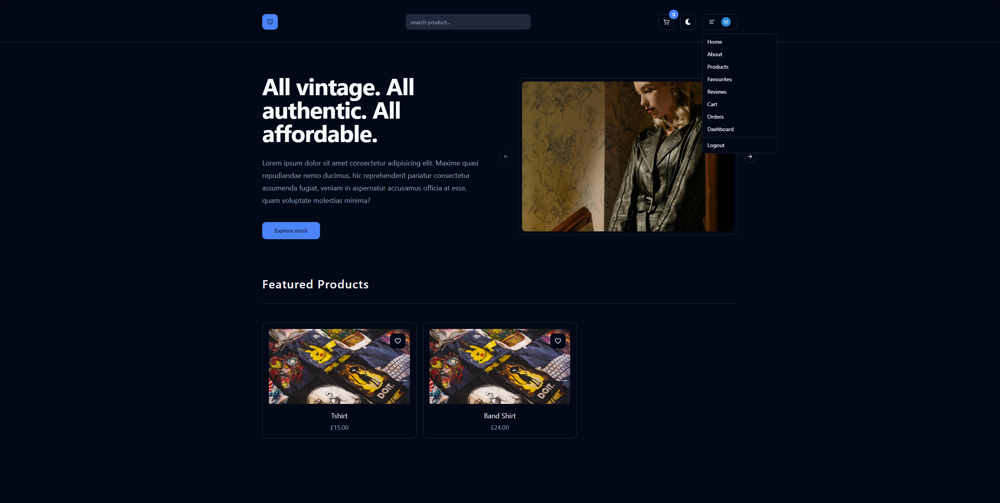
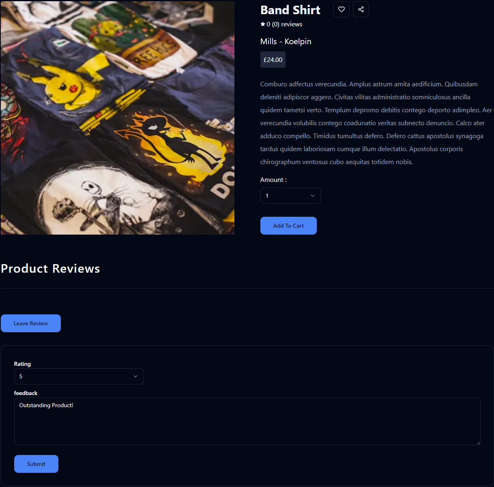
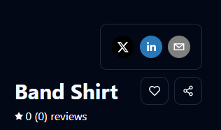
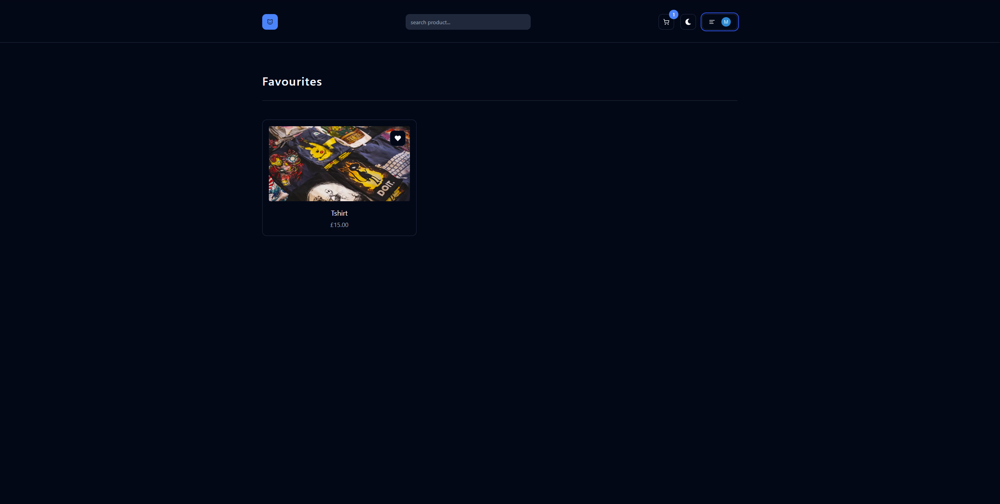
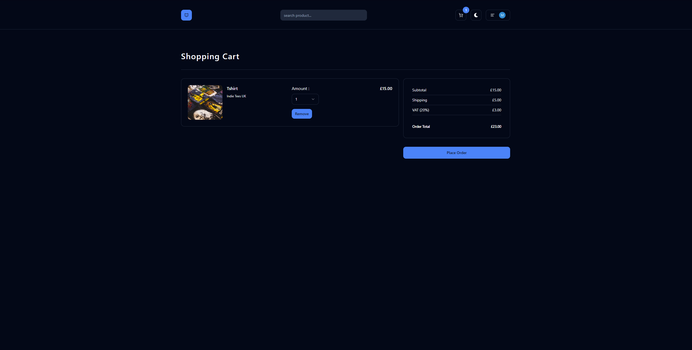
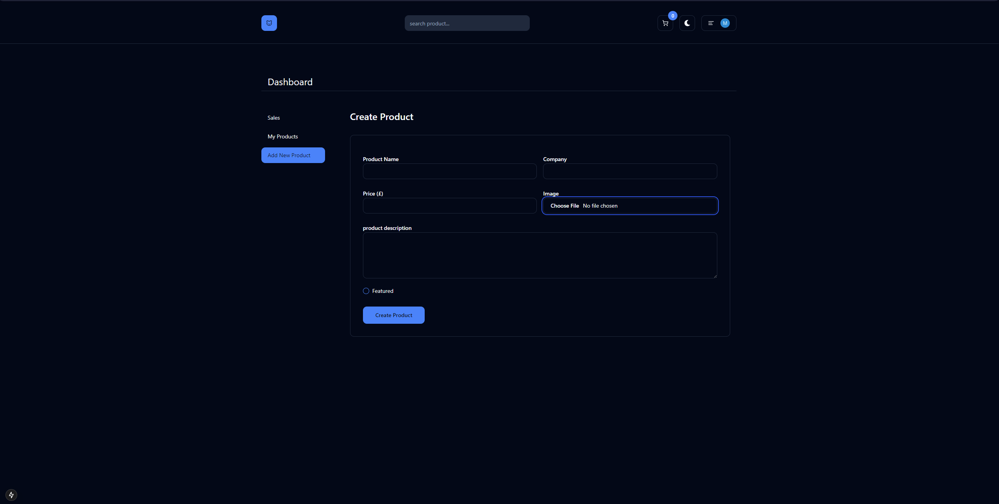
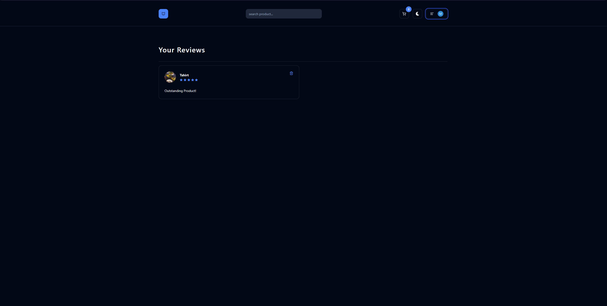
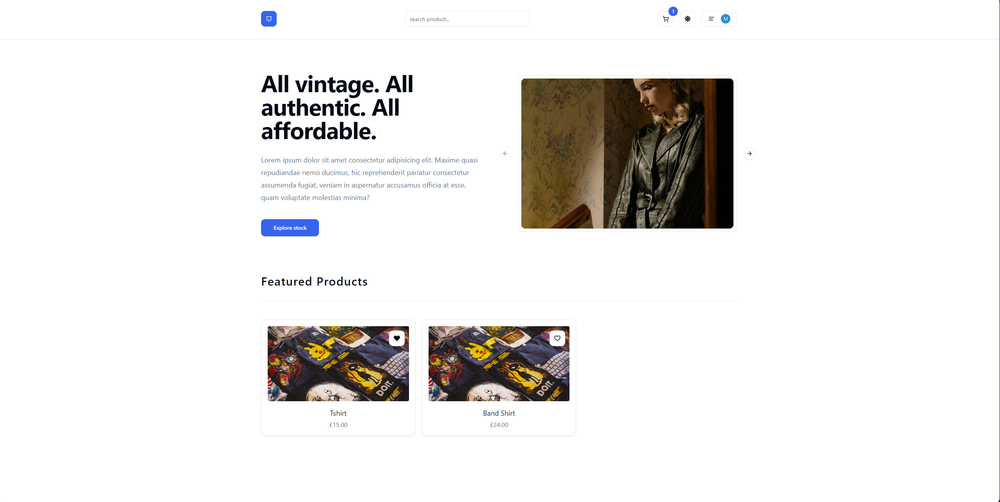

# **Freelance Shop Site Template**

A ready to use freelancing template with built-in admin permissions and Stripe integration for order checkouts. Fully set up — customise the front-end content to fit the customer's needs!

---

## **Table of Contents**

- [Overview](#overview)
- [Features](#features)
- [Demo](#demo)
- [Installation](#installation)
- [Technologies Used](#technologies-used)
- [License](#license)
- [Contact](#contact)

---

## **Overview**

Many local businesses in Hessle and Hull lack an online presence, and an online shop could greatly benefit them. To support this, I’ve developed pivotal server-side functionalities, including creating products, managing carts, and processing orders. I chose Next.js for its integration of React, TypeScript, and server actions, allowing for smooth communication between the front-end and back-end. Additionally, I’ve set up a foundational front-end that’s easy to customize and extend based on specific needs.

---

## **Features**

Highlight the core functionalities of your app in bullet points:

- Admin Permissions to create products and track orders.
- Authentication using Clerk
- Product Reviews
- Product favourites
- Order products with Stripe API.

---

## **Demo**

Front page:









> **Live Demo:**

---

## **Installation**

To set up the project locally, follow these steps:

1. Clone the repository:

   ```bash
   git clone https://github.com/yourusername/your-repo.git

   ```

2. Navigate into the project directory:

   ```bash
   cd your-repo

   ```

3. Install the required dependencies:

   ```bash
   npm install
   ```

4. Set up your environemnt variables (if any)

5. Start your dev server:
   ```bash
   npm run dev
   ```

---

## **Technologies Used**

- **Next.js**: A React framework for building server-rendered applications and static websites.
- **React**: A JavaScript library for building user interfaces.
- **Clerk**: Authentication and user management solution.
- **Axios**: A promise-based HTTP client for making API requests.
- **Stripe**: Payment processing and subscription management.
- **Shadcn/ui**: A utility-first UI component library.
- **Prisma**: A modern ORM for Node.js and TypeScript.
- **Zod**: Type-safe schema validation library.
- **Supabase**: An open-source Firebase alternative for building databases and real-time apps.

---

## **License**

Permission is hereby granted, free of charge, to any person obtaining a copy of this software and associated documentation files (the “Software”), to deal in the Software without restriction, including without limitation the rights to use, copy, modify, merge, publish, distribute, sublicense, and/or sell copies of the Software, and to permit persons to whom the Software is furnished to do so, subject to the following conditions:

The above copyright notice and this permission notice shall be included in all copies or substantial portions of the Software.

THE SOFTWARE IS PROVIDED “AS IS”, WITHOUT WARRANTY OF ANY KIND, EXPRESS OR IMPLIED, INCLUDING BUT NOT LIMITED TO THE WARRANTIES OF MERCHANTABILITY, FITNESS FOR A PARTICULAR PURPOSE AND NONINFRINGEMENT. IN NO EVENT SHALL THE AUTHORS OR COPYRIGHT HOLDERS BE LIABLE FOR ANY CLAIM, DAMAGES OR OTHER LIABILITY, WHETHER IN AN ACTION OF CONTRACT, TORT OR OTHERWISE, ARISING FROM, OUT OF OR IN CONNECTION WITH THE SOFTWARE OR THE USE OR OTHER DEALINGS IN THE SOFTWARE.

---

## **Contact**

- **Github**: [Github](https://github.com/matthewmonolith)
- **X/Twitter**: [Twitter](https://x.com/matthewpage2016)
